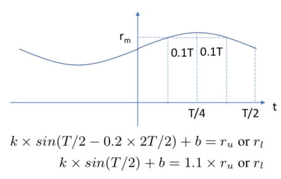
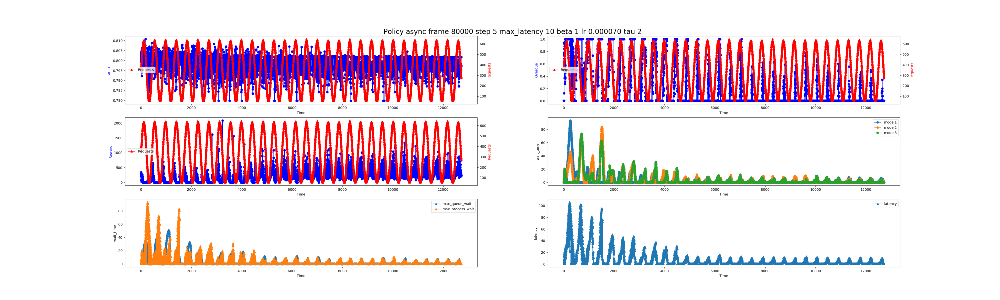
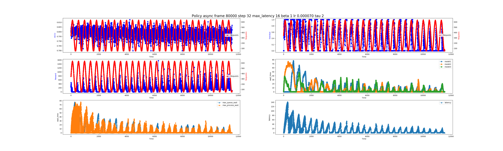
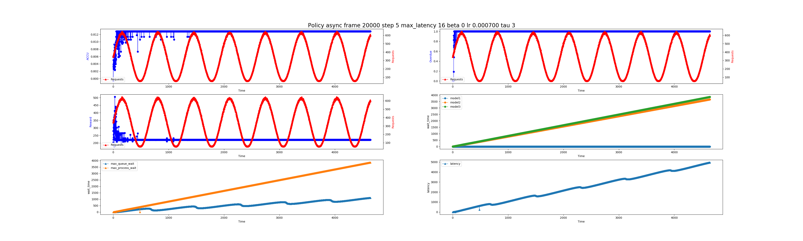

# pytorch-Rafiki

## Reference
Wang, W., Gao, J., Zhang, M., Wang, S., Chen, G., Ng, T. K., ... & Reyad, M. (2018). [Rafiki: machine learning as an analytics service system.](https://arxiv.org/pdf/1804.06087.pdf) Proceedings of the VLDB Endowment, 12(2), 128-140.

## Requirements

* Python 3.6.9
* PyTorch
* matplotlib
* numpy
* GPU (if you need)

See  for details

## Structure
- RequestGenerator
  - We simulated an request generator with a rate of `Sin` function
  - The generator will generate more requests which are larger than the maximum processing capacity in about `20%` of the cycle period
  - The peak request volume is about `1.1` times the maximum processing capacity
  
  
- ProcessingMode
  - Sync
    - run all the models for every request
  - Async
    - choose some of free models to run for the request

- Rafki 
  - Reinforcement Learning Algorithm
  - reward
    - reward = accuracy * num_process - beta * accuracy * num_overdue
  - action (scalar) 
    - action can be decoded into the model choosing and batch_size type.
    - if there are three models and four types of batch_size, then the action is in [0,27].(28 = 2^3 * 4)

## Training

#### Async

```bash
python main.py --policy async
```

#### Sync

```bash
python main.py --policy sync
```

if you want to train data on GPU, please add `--cuda`

if you want to debug the code and record the log, please add `--debug`

## Results

### Async

#### beta=1
```bash
python main.py --policy async --num-steps 5 --max_latency 10 --tau 2 --beta 1 --num-frames 80000 --lr 0.000007
```



```bash
python main.py --policy async --num-steps 32 --max_latency 16 --tau 2 --beta 1 --num-frames 80000 --lr 0.000007
```



#### beta=0

```bash
python main.py --policy async --num-steps 5 --max_latency 10 --tau 3 --beta 0 --num-frames 20000 --lr 0.00007
```




## Contributions

Contributions are very welcome. If you know how to make this code better, please open an issue. 